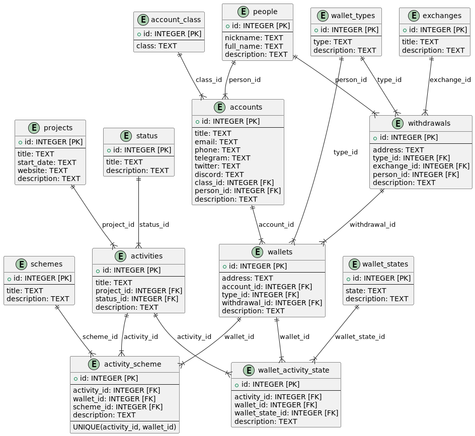

# CryptoHub Project

[Перейти на русскую версию](#русская-версия)

CryptoHub is a data model designed for managing accounts and cryptocurrency wallets, specifically tailored for tracking activities in various crypto projects. The system provides a structured way to organize and monitor your accounts, link them to projects, and manage associated wallets for seamless fund withdrawals.

You may find this project useful if you need to organize information across multiple accounts for working with various crypto projects. To work with this project, you should have basic knowledge of the following software products: SQLite and DBeaver.

## 1. Setup and Installation

### 1.1 Prerequisites

Before you start using CryptoHub, ensure that you have the following installed on your system:

- **SQLite**: A lightweight, disk-based database that doesn’t require a separate server process.
- **DBeaver**: A powerful SQL client that supports a wide range of databases, including SQLite, and provides a user-friendly interface for managing databases.

### 1.2 Installation of SQLite

1. **Windows**:
   - Download SQLite from the [official website](https://sqlite.org/download.html).
   - Unzip the file and add the path to the executable to your system's `PATH` environment variable.

2. **macOS**:
   - Install SQLite using Homebrew:
     ```sh
     brew install sqlite3
     ```

3. **Linux**:
   - Install SQLite using your distribution’s package manager:
     ```sh
     sudo apt-get install sqlite3
     ```

### 1.3 Installation of DBeaver

1. **Download and Install**:
   - Download DBeaver (Community edition is OK) from the [official website](https://dbeaver.io/download/).
   - Install it on your system following the provided instructions.

2. **Setting Up SQLite in DBeaver**:
   - Open DBeaver and create a new connection.
   - Select SQLite from the list of database types.
   - Specify the path to your database file or create a new one.

## 2. Entity Relationship Model

The diagram below illustrates the Entity Relationship Model (ERM) for the CryptoHub project. This model outlines the key entities and their relationships within the database, providing a clear structure for managing accounts, projects, wallets, and related activities.



## 3. Steps to Set Up the Database

**First, create the database structure using the `create_db.sql` script.**
This script will set up all the necessary tables and relationships required for CryptoHub.

**Next, populate the database with initial information using the `insert_initial_data.sql` script.**
This script inserts the basic data needed to start using the system, such as classifications and statuses.

**Now, populate the database with test data to demonstrate CryptoHub’s capabilities using the `insert_data.sql` script.**
Use the provided test data script to add sample records, which will allow you to explore and understand how CryptoHub functions.
   
**Run the following commands:**
```sh
sqlite3 cryptohub.db < create_db.sql
sqlite3 cryptohub.db < insert_initial_data.sql
sqlite3 cryptohub.db < insert_data.sql
```

The database name can be chosen freely. In my example, I used **cryptohub.db**. Whatever name you choose, the database file will be created automatically after running the scripts.

## 4. Usage: Entering Account Information

After the initial setup and testing with the provided test data, you can begin populating the system with your real data.

### 4.1. Transition from Test Data to Real Data

After successfully setting up and testing the system with the provided test data, it’s time to replace these test entries with your actual data. The following test data should be replaced with real information:

### **Activity Types**
Update the `activity_types` table with the actual types of activities relevant to your projects.

### **Wallet Types**
Replace the entries in the `wallet_types` table with the actual types of cryptocurrency wallets you are using.

### **Exchanges**
Update the `exchanges` table with the real exchanges you interact with.

All these changes should be made in the `insert_initial_data.sql` file. By updating this file with your real data, you ensure that CryptoHub is fully customized to your specific needs, allowing you to accurately manage and track your accounts, projects, and wallet activities.
Now, you need to modify the data in the `insert_data.sql` file to reflect your real information.
After making the changes to the scripts above, repeat the steps in section 3. The old tables will be removed, and the new data will be added.

### 4.2. Order of Data Entry - test data example

In the `activity_types`, `wallet_types`, `exchanges`, `status`, and `record_classification` tables, we will keep the initial values for now.

---
### **Table `people`**

`nickname` = 'john_1981' - a nickname of a person.

`full_name` = 'John Nukem' - a full name of a person.

`real` = 1 - a boolean value indicating whether the person is real or not.

---
### **Table `projects`**

`title` = 'CryptoProject' - the name of the project.

`start_date` = 'June 2023' - a text field with the date in any convenient format, so you can approximately determine when the project activity started.

`source` = 'nodes.guru' - a text field describing the source of information from which the project details were obtained (for example, the website nodes.guru).

`status_id` = 1 - this is a foreign key referencing the status table. If you add the project to the database using DBeaver, the foreign key will be set automatically when selecting the related value.

`description` = 'CryptoProject's description' - your brief description of the project for convenience.

---
### **Table `activities`**

`title` = 'CryptoProject Airdrop' - the name of the specific activity of the project.

`project_id` = 1 - this is a foreign key referencing out **CryptoProject** project.

`type_id` = 1 - this is a foreign key referencing out project type ('testnet').

`status_id` = 1 - this is a foreign key referencing out status ('active').

`result` = 'Gathering project info' - a text field with the activity result.

`description` = 'Activity description' - your brief description of the activity.

---
### **Table `records`**

`class_id` = 1 - this is a foreign key referencing out `record_classification` table.
Index 1 refers to a **full** account, which includes a well-developed wallet, social media records,
and other registration information. These accounts are usually few in number, 
and all activities related to them in the project are performed manually, without the use of automation. 

`nicktag` = 'John' - the nick tag of the record.
Some real people may have several records (accounts) to participate in different projects

`email` = 'johnl@gmail.com' - the e-mail of the record.

`telegram` = '@John' - the Telegram account of the record.

`twitter` = '@John' - the Twitter (x.com) account of the record.

`discord` = 'john' - the Discord account of the record.

`description` = 'John main record' - brief description of the record.

---
### **Table `withdrawals`**

`address` = 0x98765 - an address (mostly on a crypto exchange) that is used for withdrawing tokens. 

`type_id` = 1 - this is a foreign key referencing out `wallet_types` table.
Index 1 refers to a **EVM** wallet type (ETH, BSC, ARB, Polygon, etc.).

`exchange_id` = 1 - this is a foreign key referencing out `exchanges` table.
Index 1 refers to a **Binance** exchange.

`person_id` = 1 - this is a foreign key referencing out `people` table.
Index 1 refers to a **John Nukem** person. He is the one who owns this exchange wallet.

`memo` = NULL - this option may be useful for some networks (i.e. TON)

`comments` = 'John's withdraw address on Binance' - any comment you need.

---
### **Table `activity_wallets`**

`address` = 0x12345 - an address which is used in different activities. 

`type_id` = 1 - this is a foreign key referencing out `wallet_types` table.
Index 1 refers to a **EVM** wallet type (ETH, BSC, ARB, Polygon, etc.).

`withdrawal_id` = 1 - this is a foreign key referencing out `withdrawals` table.

`description` = 'Main activity wallet for John record' - brief description of the wallet.

---
### **Table `records_wallets`**

`record_id` = 1 - this is a foreign key referencing out `records` table.
Index 1 refers to John.

`activity_wallet_id` = 1 - this is a foreign key referencing out `activity_wallets` table.

`description` = 'Main activity wallet for John record' - brief description of the wallet.

---
### **Table `activities_records_projects`**

`activity_id` = 1 - this is a foreign key referencing out `activities` table.
Index 1 refers to 'CryptoProject Airdrop' activity.

`record_id` = 1 - this is a foreign key referencing out `records` table.
Index 1 refers to John.

`person_id` = 1 - this is a foreign key referencing out `people` table.
Index 1 refers to a **John Nukem** person.

`description` = 'CryptoProject Airdrop for John's main record.' - brief description.

---

### 4.3. Use of example data

Now that you have populated the tables with test data, let's run a query (DBeaver -> SQL Editor -> New SQL Script) for the activity
'CryptoProject Airdrop' to see where John can withdraw funds from his wallet for this activity.

```sql
CREATE VIEW CryptoProjectAirdrop AS
SELECT
   r.nicktag AS nickname,
   wt.type AS type,
   aw.address AS wallet,
   w.address AS withdraw
FROM
   activities a
JOIN
   activities_records_projects arp ON arp.activity_id = a.id
JOIN
   records r ON r.id = arp.record_id
JOIN
   records_wallets rw ON rw.record_id = r.id
JOIN
   activity_wallets aw ON aw.id = rw.activity_wallet_id
JOIN
   withdrawals w ON w.id = aw.withdrawal_id
JOIN
   wallet_types wt ON wt.id = w.type_id
WHERE
   a.title = 'CryptoProject Airdrop';
```

You can find this view in Views section DBeaver (press F5 to update views).

## 5. Adding Records Order

To ensure the integrity of your data and proper relational linking, follow this order when adding records:

### Initial Settings

### `activity_types`
This table stores the different types of activities that can be associated with projects. Each activity type has a unique identifier (`id`), a `title` for the activity type, and an optional `description` to provide more context.

### `wallet_types`
This table defines the different types of wallets that can be used in the system. Each type has a `type` field to specify the wallet type (e.g., Bitcoin, Ethereum) and a `description` field for further explanation.

### `exchanges`
The `exchanges` table contains information about cryptocurrency exchanges. Each exchange has a `title` and a `description` to explain what the exchange is and its role in the system.

### `status`
The `status` table defines various statuses that can be applied to projects and activities. Each status has a `title` that describes it (e.g., active, awaiting, ended).

### `record_classification`
This table categorizes user accounts into different classes. The `class` field specifies the category, which helps in classifying accounts according to their purpose or level of verification (e.g., full, trusted, dust).

### Your Records and Projects Activity Data

### `people`
This table stores information about individuals associated with accounts or activities. It includes fields for `nickname`, `full_name`, and a `real` boolean field indicating whether the person is a real individual (as opposed to a fictional or placeholder name).

### `projects`
The `projects` table contains information about various crypto projects. Each project has a unique identifier (`id`), a `title`, a `start_date`, a `source` (indicating where the project originates from), a `status_id` linking to the current status of the project, and a `description` providing further details.

### `activities`
This table tracks individual activities within a project. Each activity is linked to a specific project (`project_id`), has a type (`type_id`), and a status (`status_id`). The `result` field stores the outcome of the activity, and the `description` field provides additional details.

### `records`
The `records` table holds information about user accounts used in crypto projects. Each record includes a `class_id` to classify the account, a `nicktag` (nickname), contact details such as `email`, `telegram`, `twitter`, and `discord`, and a `description` field for any additional information.

### `withdrawals`
This table records the details of funds withdrawals from wallets. Each withdrawal is linked to a `type_id` indicating the type of wallet used, an `exchange_id` for the exchange used in the transaction, and a `person_id` for the individual involved in the withdrawal. The `address` field stores the withdrawal address, and `comments` can be used for any additional information.

### `activity_wallets`
The `activity_wallets` table stores information about wallets used in activities. Each wallet is associated with a `type_id` indicating the type of wallet (e.g., Bitcoin, Ethereum), and a `withdrawal_id` if the wallet has been used for withdrawals. The `address` field stores the wallet address, and `description` provides additional details.

### `activities_records_projects`
This is a junction table that connects activities, records (accounts), and people. It records which account (record) and person are involved in a specific activity within a project. The `description` field can be used to store any additional notes about the association.

### `records_wallets`
This junction table links user accounts (`record_id`) to wallets (`activity_wallet_id`). The `description` field can be used to provide more context about the relationship between the account and the wallet.

## Contact and Feedback

If you have any questions or suggestions, please feel free to reach out in our channel: [t.me/cryptohub_avkar](https://t.me/cryptohub_avkar). 

I would greatly appreciate your feedback and suggestions for further development.

For those who wish to show their appreciation, please use the following EVM-address: `0x37cEce2C20b29A53F8F92C59674250Ce6b7f436B`.

---

# Русская версия
# Проект CryptoHub

CryptoHub — это модель данных, предназначенная для управления учетными записями и криптовалютными кошельками, специально разработанная для отслеживания активности в различных криптопроектах. Система предоставляет структурированный способ организации и мониторинга ваших учетных записей, связывания их с проектами и управления связанными кошельками для беспрепятственного вывода средств.

Этот проект может быть полезен, если вам нужно организовать информацию по множеству учетных записей для работы с различными криптопроектами. Для работы с этим проектом вам нужно иметь базовые знания следующих программных продуктов: SQLite и DBeaver.

## 1. Установка и настройка

### 1.1 Требования

Перед началом использования CryptoHub убедитесь, что на вашем компьютере установлены следующие программы:

- **SQLite**: Легковесная, файловая база данных, которая не требует запуска отдельного процесса на сервере.
- **DBeaver**: Мощный SQL-клиент, поддерживающий широкий спектр баз данных, включая SQLite, и предоставляющий удобный интерфейс для управления базами данных.

### 1.2 Установка SQLite

1. **Windows**:
   - Скачайте SQLite с [официального сайта](https://sqlite.org/download.html).
   - Распакуйте файл и добавьте путь к исполняемому файлу в переменную окружения `PATH`.

2. **macOS**:
   - Установите SQLite через Homebrew:
     ```sh
     brew install sqlite3
     ```

3. **Linux**:
   - Установите SQLite с помощью пакетного менеджера вашей системы:
     ```sh
     sudo apt-get install sqlite3
     ```

### 1.3 Установка DBeaver

1. **Загрузка и установка**:
   - Скачайте DBeaver (достаточно Community edition) с [официального сайта](https://dbeaver.io/download/).
   - Установите его на ваш компьютер, следуя предоставленным инструкциям.

2. **Настройка SQLite в DBeaver**:
   - Откройте DBeaver и создайте новое подключение.
   - Выберите SQLite из списка типов баз данных.
   - Укажите путь к вашему файлу базы данных или создайте новый файл базы данных.

## 2. Структура базы данных

Диаграмма ниже иллюстрирует структуру базы данных проекта Cryptohub. Эта модель описывает основные сущности и их связи в базе данных, предоставляя четкую структуру для управления учетными записями, проектами, кошельками и связанными с ними активностями.


## 3. Шаги по настройке базы данных

**Сначала создайте структуру базы данных с помощью скрипта `create_db.sql`.**
Этот скрипт создаст все необходимые таблицы и связи, требуемые для работы CryptoHub.

**Затем наполните базу данных первоначальной информацией с помощью скрипта `insert_initial_data.sql`.**
Этот скрипт вставит основные данные, необходимые для начала работы с системой, такие как классификации и статусы.

**Теперь наполните базу данных тестовыми данными, чтобы продемонстрировать возможности CryptoHub, с помощью скрипта `insert_data.sql`.**
Используйте предоставленный скрипт для добавления тестовых записей, что позволит вам исследовать и понять, как работает CryptoHub.

**Выполните следующие команды:**
```sh
sqlite3 cryptohub.db < create_db.sql
sqlite3 cryptohub.db < insert_initial_data.sql
sqlite3 cryptohub.db < insert_data.sql
```

Название базы данных можно выбрать любое. В моем примере используется cryptohub.db. Какое бы название не было выбрано, файл с базой данных после запука скриптов будет создан автоматически.

## 4. Использование: Ввод информации об учетных записях

После первоначальной настройки и тестирования на предоставленных тестовых данных вы можете начать заполнять систему реальными данными.

### 4.1 Переход от тестовых данных к реальным

После успешной настройки и тестирования системы на предоставленных тестовых данных пришло время заменить эти тестовые записи на ваши реальные данные:

### **Типы активности**
Обновите таблицу `activity_types`, добавив актуальные типы активности, относящиеся к вашим проектам.

### **Типы кошельков**
Замените записи в таблице `wallet_types` на актуальные типы криптовалютных кошельков, которые вы используете.

### **Криптобиржи**
Обновите таблицу `exchanges`, добавив реальные биржи, с которыми вы взаимодействуете.

Все эти изменения следует внести в файл `insert_initial_data.sql`. Обновив этот файл вашими реальными данными, вы настроите CryptoHub в соответствии с вашими конкретными потребностями, что позволит вам точно управлять и отслеживать ваши учетные записи, проекты и операции с кошельками.
Теперь вам нужно изменить данные в файле `insert_data.sql`, чтобы они соответствовали вашим реальным данным.
После того, как вы внесете изменения в скрипты выше, проделайте шаги в пункте 3 еще раз. Старые таблицы будут удалены, новые данные добавлены. 

### 4.2 Порядок ввода данных — пример тестовых данных

В таблицах `activity_types`, `wallet_types`, `exchanges`, `status` и `record_classification` пока оставим первоначальные значения.

---
### **Таблица `people`**

`nickname` = 'john_1981' - никнейм человека.

`full_name` = 'John Nukem' - полное имя человека.

`real` = 1 - булево значение, указывающее, является ли человек реальным или нет.

---
### **Таблица `projects`**

`title` = 'CryptoProject' - название проекта.

`start_date` = 'June 2023' - текстовое поле с датой в любом удобном формате, чтобы примерно определить, когда началась активность по проекту.

`source` = 'nodes.guru' - текстовое поле с описанием источника информации, откуда была получена информация о проекте (например, сайт nodes.guru).

`status_id` = 1 - это внешний ключ, ссылающийся на таблицу со статусами. Если добавлять проект в базу данных с помощью DBeaver, то внешний ключ проставится автоматически при выборе связанного значения.

`description` = 'Описание CryptoProject' - краткое описание проекта для удобства.

---
### **Таблица `activities`**

`title` = 'CryptoProject Airdrop' - название конкретной активности проекта.

`project_id` = 1 - это внешний ключ, ссылающийся на наш проект **CryptoProject**.

`type_id` = 1 - это внешний ключ, ссылающийся на тип проекта ('Testnet').

`status_id` = 1 - это внешний ключ, ссылающийся на статус ('active').

`result` = 'Сбор информации' - текстовое поле с результатом активности.

`description` = 'Описание активности' - краткое описание активности.

---
### **Таблица `records`**

`class_id` = 1 - это внешний ключ, ссылающийся на таблицу `record_classification`.
Индекс 1 ссылается на **full** аккаунт, который включает проработанный кошелек, записи в социальных сетях и другую регистрационную информацию. Этих аккаунтов обычно немного, и все действия по ним в проекте выполняются вручную, без использования автоматизации.

`nicktag` = 'John' - никнейм учетной записи.
Некоторые реальные люди могут иметь несколько учетных записей для участия в различных проектах.

`email` = 'johnl@gmail.com' - адрес электронной почты учетной записи.

`telegram` = '@John' - аккаунт Telegram учетной записи.

`twitter` = '@John' - аккаунт Twitter (x.com) учетной записи.

`discord` = 'john' - аккаунт Discord учетной записи.

`description` = 'Основная учетная запись Джона' - краткое описание учетной записи.

---
### **Таблица `withdrawals`**

`address` = 0x98765 - адрес (используем адрес криптобиржи для вывода), который используется для вывода токенов.

`type_id` = 1 - это внешний ключ, ссылающийся на таблицу `wallet_types`.
Индекс 1 ссылается на тип кошелька **EVM** (ETH, BSC, ARB, Polygon и т.д.).

`exchange_id` = 1 - это внешний ключ, ссылающийся на таблицу `exchanges`.
Индекс 1 ссылается на биржу **Binance**.

`person_id` = 1 - это внешний ключ, ссылающийся на таблицу `people`.
Индекс 1 ссылается на человека **John Nukem**. Он является владельцем этого кошелька на бирже.

`memo` = NULL - эта опция может быть полезна для некоторых сетей (например, TON).

`comments` = 'Адрес вывода Джона на Binance' - любой комментарий, который вам нужен.

---
### **Таблица `activity_wallets`**

`address` = 0x12345 - адрес, который используется в различных активностях.

`type_id` = 1 - это внешний ключ, ссылающийся на таблицу `wallet_types`.
Индекс 1 ссылается на тип кошелька **EVM** (ETH, BSC, ARB, Polygon и т.д.).

`withdrawal_id` = 1 - это внешний ключ, ссылающийся на таблицу `withdrawals`.

`description` = 'Основной кошелек активности для учетной записи Джона' - краткое описание кошелька.

---
### **Таблица `records_wallets`**

`record_id` = 1 - это внешний ключ, ссылающийся на таблицу `records`.
Индекс 1 ссылается на Джона.

`activity_wallet_id` = 1 - это внешний ключ, ссылающийся на таблицу `activity_wallets`.

`description` = 'Основной кошелек активности для учетной записи Джона' - краткое описание кошелька.

---
### **Таблица `activities_records_projects`**

`activity_id` = 1 - это внешний ключ, ссылающийся на таблицу `activities`.
Индекс 1 ссылается на активность 'CryptoProject Airdrop'.

`record_id` = 1 - это внешний ключ, ссылающийся на таблицу `records`.
Индекс 1 ссылается на Джона.

`person_id` = 1 - это внешний ключ, ссылающийся на таблицу `people`.
Индекс 1 ссылается на человека **John Nukem**.

`description` = 'CryptoProject Airdrop для основной учетной записи Джона.' - краткое описание.

---

### 4.3 Использование примерных данных

Теперь, когда вы заполнили таблицы тестовыми данными, давайте сделаем выборку для активности 'CryptoProject Airdrop', чтобы увидеть, куда Джон может выводить средства с его кошелька по данной активности (DBeaver -> SQL Editor -> Новый SQL скрипт).

```sql
CREATE VIEW CryptoProjectAirdrop AS
SELECT
   r.nicktag AS nickname,
   wt.type AS type,
   aw.address AS wallet,
   w.address AS withdraw
FROM
   activities a
JOIN
   activities_records_projects arp ON arp.activity_id = a.id
JOIN
   records r ON r.id = arp.record_id
JOIN
   records_wallets rw ON rw.record_id = r.id
JOIN
   activity_wallets aw ON aw.id = rw.activity_wallet_id
JOIN
   withdrawals w ON w.id = aw.withdrawal_id
JOIN
   wallet_types wt ON wt.id = w.type_id
WHERE
   a.title = 'CryptoProject Airdrop';
```

После запуска этого скрипта вы можете найти это представление (View) в разделе Views DBeaver (нажмите F5 для обновления представлений).

## 5. Порядок добавления записей

Чтобы обеспечить целостность ваших данных и правильную установку связей между ними, следуйте этому порядку при добавлении записей:

### Первоначальные настройки

### `activity_types`
Эта таблица хранит различные типы активностей, которые могут быть связаны с проектами. Каждый тип активности имеет уникальный идентификатор (`id`), `title` для типа активности и необязательное поле `description` для предоставления дополнительной информации.

### `wallet_types`
Эта таблица определяет различные типы кошельков, которые могут быть использованы в системе. Каждый тип имеет поле `type`, указывающее тип кошелька (например, Bitcoin, Ethereum), и поле `description` для дальнейших пояснений.

### `exchanges`
Таблица `exchanges` содержит информацию о криптовалютных биржах. Каждая биржа имеет поле `title` и `description` для объяснения, что это за биржа и какую роль она играет в системе.

### `status`
Таблица `status` определяет различные статусы, которые могут быть применены к проектам и активностям. Каждый статус имеет поле `title`, описывающее его (например, активен, ожидает, завершен).

### `record_classification`
Эта таблица классифицирует учетные записи пользователей по различным классам. Поле `class` указывает категорию, которая помогает классифицировать учетные записи в зависимости от их цели или уровня верификации (например, полный, доверенный, черновой).

### Ваши данные об учетных записях и активности проектов

### `people`
Эта таблица хранит информацию о людях, связанных с учетными записями или активностями. Включает поля `nickname`, `full_name` и логическое поле `real`, указывающее, является ли человек реальным.

### `projects`
Таблица `projects` содержит информацию о различных криптопроектах. Каждый проект имеет уникальный идентификатор (`id`), `title`, `start_date`, `source` (указывающий на источник проекта), `status_id`, ссылающийся на текущий статус проекта, и `description`, предоставляющее дополнительные сведения.

### `activities`
Эта таблица отслеживает отдельные активности в рамках проекта. Каждая активность связана с определенным проектом (`project_id`), имеет тип (`type_id`) и статус (`status_id`). Поле `result` хранит результат активности, а поле `description` предоставляет дополнительные детали.

### `records`
Таблица `records` хранит информацию об учетных записях пользователей, использующихся в криптопроектах. Каждая запись включает `class_id` для классификации учетной записи, `nicktag` (никнейм), контактные данные, такие как `email`, `telegram`, `twitter`, `discord`, и поле `description` для любой дополнительной информации.

### `withdrawals`
Эта таблица записывает информацию о выводе средств из кошельков. Каждый вывод связан с `type_id`, указывающим тип используемого кошелька, `exchange_id` для криптобиржи, использованной в транзакции, и `person_id` для человека, участвующего в выводе средств. Поле `address` хранит адрес вывода, а поле `comments` может быть использовано для любой дополнительной информации.

### `activity_wallets`
Таблица `activity_wallets` хранит информацию о кошельках, используемых в активностях. Каждый кошелек связан с `type_id`, указывающим тип кошелька (например, Bitcoin, Ethereum), и `withdrawal_id`, если кошелек использовался для вывода средств. Поле `address` хранит адрес кошелька, а поле `description` предоставляет дополнительные детали.

### `activities_records_projects`
Это связующая таблица, которая соединяет активности, учетные записи (records) и людей. В ней записывается, какая учетная запись и человек участвуют в конкретной активности в рамках проекта. Поле `description` может использоваться для хранения любых дополнительных заметок о связи.

### `records_wallets`
Эта связующая таблица связывает учетные записи (`record_id`) с кошельками (`activity_wallet_id`). Поле `description` может быть использовано для предоставления большего контекста о связи между учетной записью и кошельком.

## Контакты и обратная связь

С вопросами и пожеланиями прошу обращаться в канал: [t.me/cryptohub_avkar](https://t.me/cryptohub_avkar).

Буду признателен за обратную связь и предложения по развитию Cryptohub.

Для тех, кто хочет выразить свою благодарность, пожалуйста, используйте следующий EVM-адрес: `0x37cEce2C20b29A53F8F92C59674250Ce6b7f436B`.